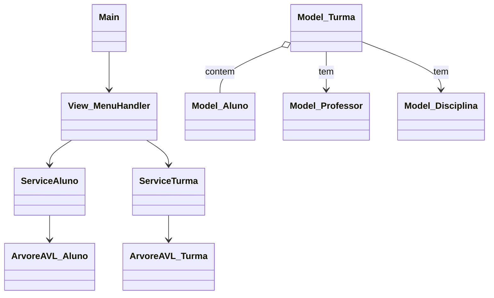

# Sistema de Gestão Acadêmica (Secretaria)

Este projeto consiste em um sistema de gerenciamento de secretaria escolar desenvolvido em **Java**. A ideia aqui é simples, porém ambiciosa: organizar o caos acadêmico com elegância algorítmica. O sistema permite o cadastro e controle de alunos, professores, disciplinas, cursos e turmas, utilizando uma **Árvore AVL** (Adelson-Velsky and Landis) como estrutura de dados principal para armazenamento e busca eficiente das informações.

> **Contexto Acadêmico**
> Projeto desenvolvido como **Trabalho Final da disciplina Estruturas de Dados Básicas II (EDB2)** do curso de Tecnologia da Informação – **UFRN**.
> O objetivo foi aplicar, na prática, uma árvore binária de busca balanceada (AVL) em um cenário real de aplicação, cobrindo operações completas de **CRUD**.

---

## Funcionalidades

O sistema é executado via **terminal (Console Application)** e está dividido em módulos bem definidos.

### Gestão de Alunos

* Cadastro de novos alunos, vinculando-os a uma turma existente.
* Busca de alunos por matrícula.
* Atualização de dados cadastrais.
* Remoção de alunos.
* Listagem de todos os alunos em ordem de matrícula.
* Visualização da **estrutura da Árvore AVL de Alunos**.

### Gestão de Professores

* Cadastro de professores com disciplina de especialidade.
* Busca, atualização e remoção de professores.
* Listagem de professores.
* Visualização da **estrutura da Árvore AVL de Professores**.

### Gestão de Turmas

* Criação de turmas por ano e semestre.
* Vinculação de **Curso**, **Disciplina** e **Professor** à turma.
* Matrícula de alunos nas turmas.
* Remoção de turmas com verificação de dependências.

### Gestão de Cursos e Disciplinas

* CRUD completo para cursos e disciplinas.
* Controle de carga horária e duração.

### Funcionalidade Extra

* **Carga de Dados Iniciais:** ao iniciar o sistema, o usuário pode optar por carregar dados fictícios (mock data). Isso facilita testes, demonstrações e a visualização das árvores já balanceadas.

---

## Arquitetura e Tecnologias

O projeto segue uma organização em camadas, evitando o famoso “código espaguete” e facilitando manutenção e evolução futura.

* **Linguagem:** Java (JDK 8 ou superior).
* **Estrutura de Dados:** Árvore AVL genérica (`ArvoreAVL<T>`).

  * Implementação de rotações simples e duplas (esquerda e direita).
  * Garantia de complexidade **O(log n)** para inserção, remoção e busca.
* **Padrão de Projeto:** MVC simplificado (Model, View e Services).

### Estrutura de Pacotes

```
src/
├── Model        # Classes de domínio (Aluno, Professor, Turma, etc.)
├── ArvoreAVL    # Implementação da AVL (No, ArvoreAVL)
├── Services     # Regras de negócio e manipulação das árvores
├── View         # Menus e interação com o usuário
└── Utils        # Utilitários para entrada de dados segura
```

Todas as classes de domínio implementam `Comparable`, permitindo ordenação direta dentro da árvore AVL.

---

## Como Executar

O projeto conta com um **Makefile**, facilitando a vida em sistemas Unix/Linux/macOS. Menos comandos, mais produtividade.

### Pré-requisitos

* Java Development Kit (JDK) instalado.
* Make (opcional, mas recomendado).

### Passo a Passo

1. **Clone o repositório**

```bash
git clone https://github.com/JoseGildenilson/SistemaSecretaria.git
cd sistema-secretaria
```

2. **Compile e execute usando o Makefile**

```bash
make run
```

Esse comando compila os arquivos `.java` para a pasta `bin` e inicia o sistema.

3. **Compilação manual (sem Makefile)**

Útil para ambientes Windows ou caso o `make` não esteja disponível:

```bash
mkdir bin
javac -d bin -sourcepath src src/Main.java
java -cp bin Main
```

4. **Limpeza dos arquivos compilados**

```bash
make clean
```

---

## Diagrama de Classes

Abaixo está um diagrama simplificado das principais relações entre as classes, utilizando **Mermaid**.

> Caso o GitHub não renderize corretamente, consulte o arquivo `diagrama.md`.



O diagrama acima é apenas um resumo. A versão completa está disponível em `diagrama.md`.

---

## Colaboradores

- **[Gil](https://github.com/JoseGildenilson)**
- **[João Claudio](https://github.com/JoaoClaudio7)**
- **[Thyago Pereira](https://github.com/Thyagopds)**

---

Projeto feito com foco em clareza, organização e eficiência algorítmica.
