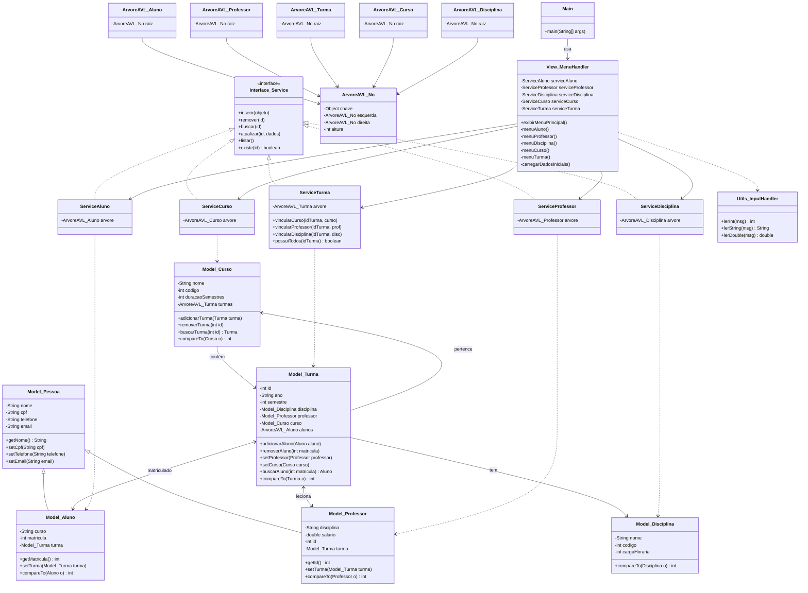

# Diagrama de Classes do Sistema

```mermaid
classDiagram

%% ==========================================
%% VIEW
%% ==========================================
class View_MenuHandler {
    -ServiceAluno serviceAluno
    -ServiceProfessor serviceProfessor
    -ServiceDisciplina serviceDisciplina
    -ServiceCurso serviceCurso
    -ServiceTurma serviceTurma

    +exibirMenuPrincipal()
    -menuAluno()
    -menuProfessor()
    -menuDisciplina()
    -menuCurso()
    -menuTurma()
    -carregarDadosIniciais()
}

class Main {
    +main(String[] args)
}

Main --> View_MenuHandler : usa


%% ==========================================
%% MODEL
%% ==========================================
class Model_Pessoa {
    -String nome
    -String cpf
    -String telefone
    -String email
    +getNome() String
    +setCpf(String cpf)
    +setTelefone(String telefone)
    +setEmail(String email)
}

class Model_Aluno {
    -String curso
    -int matricula
    -Model_Turma turma
    +getMatricula() int
    +setTurma(Model_Turma turma)
    +compareTo(Aluno o) int
}

class Model_Professor {
    -String disciplina
    -double salario
    -int id
    -Model_Turma turma
    +getId() int
    +setTurma(Model_Turma turma)
    +compareTo(Professor o) int
}

class Model_Turma {
    -int id
    -String ano
    -int semestre
    -Model_Disciplina disciplina
    -Model_Professor professor
    -Model_Curso curso
    -ArvoreAVL_Aluno alunos
    +adicionarAluno(Aluno aluno)
    +removerAluno(int matricula)
    +setProfessor(Professor professor)
    +setCurso(Curso curso)
    +buscarAluno(int matricula) Aluno
    +compareTo(Turma o) int
}

class Model_Curso {
    -String nome
    -int codigo
    -int duracaoSemestres
    -ArvoreAVL_Turma turmas
    +adicionarTurma(Turma turma)
    +removerTurma(int id)
    +buscarTurma(int id) Turma
    +compareTo(Curso o) int
}

class Model_Disciplina {
    -String nome
    -int codigo
    -int cargaHoraria
    +compareTo(Disciplina o) int
}

Model_Pessoa <|-- Model_Aluno
Model_Pessoa <|-- Model_Professor

Model_Turma --> Model_Curso : pertence
Model_Curso --> Model_Turma : contém
Model_Turma --> Model_Disciplina : tem
Model_Turma <--> Model_Professor : leciona
Model_Turma <--> Model_Aluno : matriculado


%% ==========================================
%% ARVORE AVL (SEM GENERICS)
%% ==========================================
class ArvoreAVL_No {
    -Object chave
    -ArvoreAVL_No esquerda
    -ArvoreAVL_No direita
    -int altura
}

class ArvoreAVL_Aluno {
    -ArvoreAVL_No raiz
}

class ArvoreAVL_Professor {
    -ArvoreAVL_No raiz
}

class ArvoreAVL_Turma {
    -ArvoreAVL_No raiz
}

class ArvoreAVL_Curso {
    -ArvoreAVL_No raiz
}

class ArvoreAVL_Disciplina {
    -ArvoreAVL_No raiz
}

ArvoreAVL_Aluno --> ArvoreAVL_No
ArvoreAVL_Professor --> ArvoreAVL_No
ArvoreAVL_Turma --> ArvoreAVL_No
ArvoreAVL_Curso --> ArvoreAVL_No
ArvoreAVL_Disciplina --> ArvoreAVL_No


%% ==========================================
%% INTERFACE SERVICE
%% ==========================================
class Interface_Service {
    <<interface>>
    +inserir(objeto)
    +remover(id)
    +buscar(id)
    +atualizar(id, dados)
    +listar()
    +existe(id) boolean
}


%% ==========================================
%% SERVICES
%% ==========================================
class ServiceAluno {
    -ArvoreAVL_Aluno arvore
}
class ServiceProfessor {
    -ArvoreAVL_Professor arvore
}
class ServiceCurso {
    -ArvoreAVL_Curso arvore
}
class ServiceDisciplina {
    -ArvoreAVL_Disciplina arvore
}
class ServiceTurma {
    -ArvoreAVL_Turma arvore
    +vincularCurso(idTurma, curso)
    +vincularProfessor(idTurma, prof)
    +vincularDisciplina(idTurma, disc)
    +possuiTodos(idTurma) boolean
}

Interface_Service <|.. ServiceAluno
Interface_Service <|.. ServiceProfessor
Interface_Service <|.. ServiceCurso
Interface_Service <|.. ServiceDisciplina
Interface_Service <|.. ServiceTurma


%% Dependências View -> Services
View_MenuHandler --> ServiceAluno
View_MenuHandler --> ServiceProfessor
View_MenuHandler --> ServiceCurso
View_MenuHandler --> ServiceDisciplina
View_MenuHandler --> ServiceTurma


%% Dependências Services -> Model
ServiceAluno ..> Model_Aluno
ServiceProfessor ..> Model_Professor
ServiceCurso ..> Model_Curso
ServiceDisciplina ..> Model_Disciplina
ServiceTurma ..> Model_Turma


%% ==========================================
%% UTILS
%% ==========================================
class Utils_InputHandler {
    +lerInt(msg) int
    +lerString(msg) String
    +lerDouble(msg) double
}

View_MenuHandler ..> Utils_InputHandler

```
